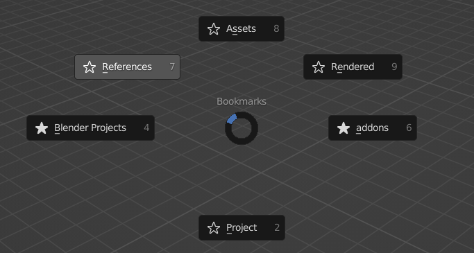
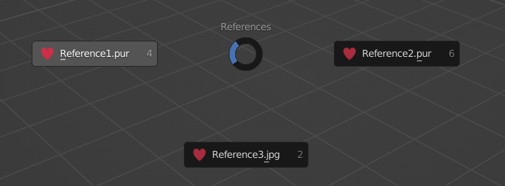

# BlenDir v0.17.2 <!-- omit in toc -->

**BlenDir** is a Blender add-on for automatic folder structure creation and management!

## Table of Contents <!-- omit in toc -->

- [Features](#features)
  - [Create complex project folder structure in one click](#create-complex-project-folder-structure-in-one-click)
  - [Easily browse saved folder structures](#easily-browse-saved-folder-structures)
  - [Bookmarks](#bookmarks)
  - [References Menu](#references-menu)
  - [Generate folder structure files from existing directories](#generate-folder-structure-files-from-existing-directories)
  - [Keywords](#keywords)
  - [Keymap](#keymap)
  - [More Features](#more-features)
- [Setup Instructions](#setup-instructions)
- [BlenDir Workflow Example](#blendir-workflow-example)
- [Installation](#installation)
  - [Method 1 (recommended)](#method-1-recommended)
  - [Method 2](#method-2)
- [Notes](#notes)

## Features

### Create complex project folder structure in one click

### Easily browse saved folder structures

### Bookmarks

Add local and global folder bookmarks. Selecting a bookmark will open it in the default OS file browser

### References Menu

Quickly open your project references with a pie menu

### Generate folder structure files from existing directories

- Click 
- Use the directory browser to select a root folder

- The complete folder structure file will be generated automatically
- This file can be used to recreate the saved structure with one click

### Keywords

Add keywords to your folder structures to program the folder structure generator!

- `*B` Move Blender file to this directory
- `*F` Current file name
- `*D` Current date
- `*X` `*Y` `*Z` Replaced with input from the preferences
- `*M` Bookmark this folder. This will add the folder to the `Bookmarks` pie menu for this project only
- `*R` Mark this folder as the reference folder. All files added to this folder will show up in the `References` pie menu
- `*O` Set the animation output path to this folder

### Keymap

- Create Folders: Start BlenDir without having to open the sidebar
- Bookmarks: Open the folder bookmarks pie menu
- References: Open the references pie menu

### More Features

- For more information, read the tooltips/descriptions of the buttons and settings

## Setup Instructions

1. Delete the `Animation` and `Example` demo structures that come with BlenDir (use the BlenDir delete button)
2. Click the [import](#generate-folder-structure-files-from-existing-directories) button or the new structure button to create a folder structure file
3. Add [keywords](#keywords) to the file for custom functionality. For example:

     - replace the root folder name with `*F*B`
     - add `*M` to all folders you want to bookmark
     - add `*R` to your references folder
     - add `*O` to your render folder

4. In the preferences, click `Save Default Structure`. The current structure will be saved and set to active when starting a new Blender file

## BlenDir Workflow Example

1. Open a new Blender file
2. Press `Shift` `Ctrl` `F` (default keymap)
3. Use the BlenDir file browser to save the file
4. Folders will be created automatically after saving!
5. If the reference folder is set, you will now be able to quickly open your references when opening this project

## Installation

### Method 1 (recommended)

- Download the `ZIP` file (don't extract it)
  - Either go to [Releases](https://github.com/DanielBoxer/BlenDir/releases/latest) and download the `ZIP` file for the latest stable version
  - Or press the `Code` button at the top of the page and then `Download ZIP` for the newest experimental version

- Don't add a `.` to the folder name, this will cause an import error
- In Blender, open `Preferences` and go to `Add-ons`
- Click `Install`
- Select the `ZIP` file in the file browser
- Click `Install Add-on`
- Enable the add-on by checking the box

### Method 2

- Download BlenDir
- Extract the `ZIP` file
- Move the folder inside the extracted folder into your Blender `addons` directory
- Enable BlenDir

## Notes

- BlenDir is for Blender version 2.90 and above
- Works on Windows and Linux, untested on macOS
