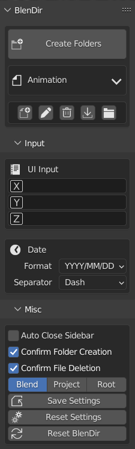
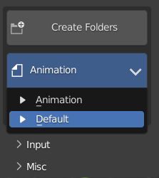
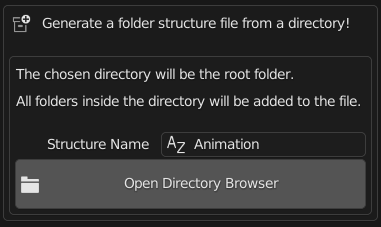
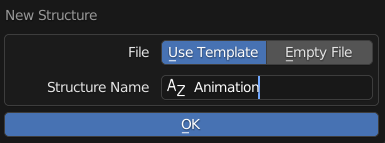
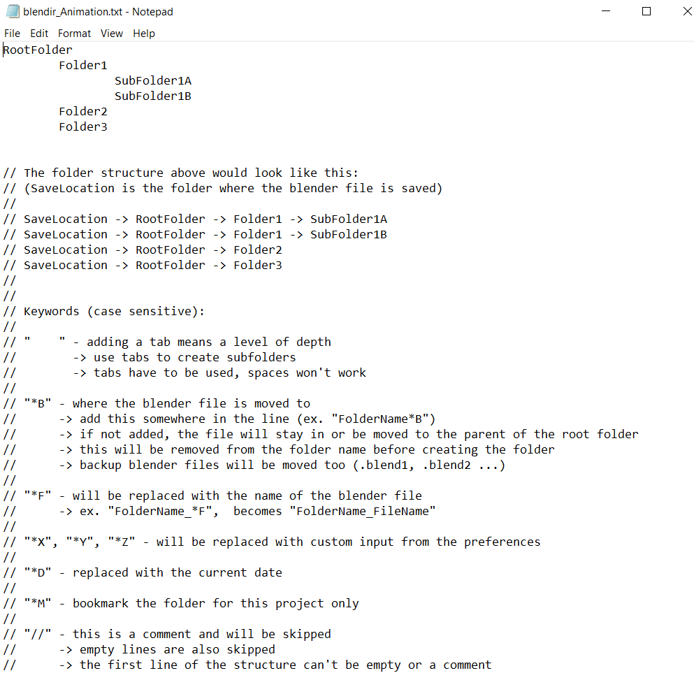
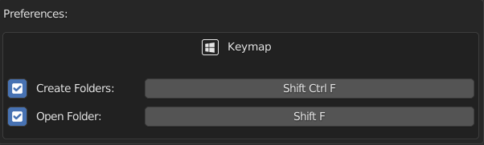
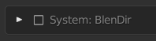

# BlenDir v0.9.3 (WIP) <!-- omit in toc -->

**BlenDir** is a Blender add-on for automatic folder structure creation!

## Table of Contents <!-- omit in toc -->

- [Features](#features)
  - [Create complex project folder structure in one click](#create-complex-project-folder-structure-in-one-click)
  - [Easily browse saved folder structures](#easily-browse-saved-folder-structures)
  - [Generate folder structure files from existing directories](#generate-folder-structure-files-from-existing-directories)
  - [Keywords](#keywords)
  - [Make custom folder structures](#make-custom-folder-structures)
  - [Edit saved folder structures](#edit-saved-folder-structures)
  - [Open project location](#open-project-location)
  - [Keymap](#keymap)
  - [Save startup settings](#save-startup-settings)
- [Setup Instructions](#setup-instructions)
- [BlenDir Workflow Example](#blendir-workflow-example)
- [Installation](#installation)
  - [Method 1 (recommended)](#method-1-recommended)
  - [Method 2](#method-2)
- [Notes](#notes)

## Features

### Create complex project folder structure in one click

### Easily browse saved folder structures

### Generate folder structure files from existing directories

- Click 
- Use the directory browser to select a root folder

- The complete folder structure file will be generated automatically
- This file can be used to recreate the saved structure with one click

### Keywords

Add keywords to program the folder structure generator!

- `*B` Move Blender file to this directory
- `*F` Current file name
- `*D` Current date
- `*X` `*Y` `*Z` Custom input

### Make custom folder structures

- Click 
- After entering the name, the new structure will open in your default text editor

- Choose `Use Template` to start with extra information about how to create the structure

### Edit saved folder structures

- Click 
- The structure will open in the default text editor

### Open project location

- Click 
- The location of the current Blender file will open in the file browser

### Keymap

- Quickly start BlenDir without having to open the sidebar

### Save startup settings

- Click 
- The current settings will be saved and loaded when starting Blender

## Setup Instructions

1. Delete the `Animation` and `Default` demo structures that come with BlenDir (use the BlenDir delete button)
2. Click the [import](#generate-folder-structure-files-from-existing-directories) button or the [new structure](#generate-folder-structure-files-from-existing-directories) button to create a folder structure file
3. Add [keywords](#keywords) to the file for custom functionality (ex. replace the root folder name with *F\*B)
4. Change the `Input` and `Misc` panel settings (optional)
5. In the `Misc` panel, click `Save Settings` to save a new startup file

## BlenDir Workflow Example

1. Open a new Blender file
2. Press `Shift` `Ctrl` `F` (default keymap)
3. Use the BlenDir file browser to save the file
4. Folders will be created automatically after saving!

## Installation

### Method 1 (recommended)

- Download the `ZIP` file (don't extract it)

 

- In Blender, open `Preferences` and go to `Add-ons`
- Click `Install`
- Select the `ZIP` file in the file browser
- Click `Install Add-on`
- Enable the add-on by checking the box

### Method 2

- Download BlenDir
- Extract the `ZIP` file
- Move the folder inside the extracted folder into your Blender `addons` directory
- Enable BlenDir

## Notes

- For more information, read the tooltips/descriptions of the buttons and settings
- BlenDir is for Blender version 2.90 and above
