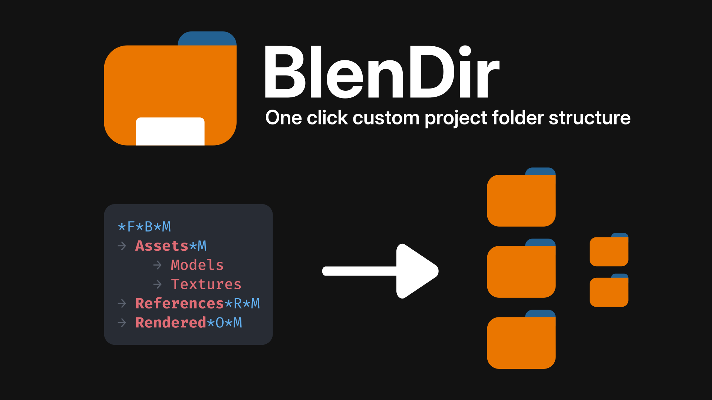
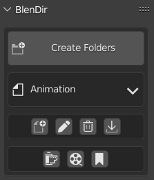
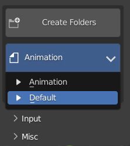
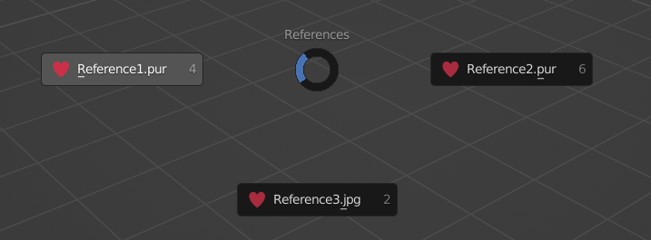
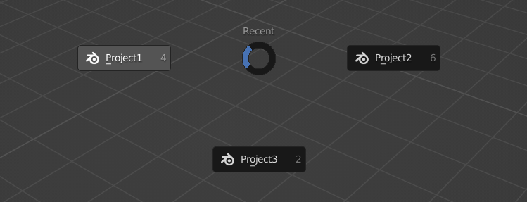
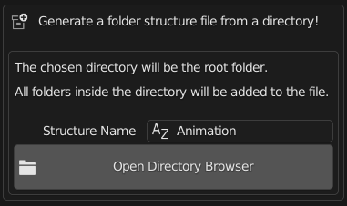

**BlenDir** is a Blender add-on for automatic project folder structure creation and management!



## Table of Contents <!-- omit in toc -->

- [Features](#features)
  - [One Click Project Folder Structure](#one-click-project-folder-structure)
  - [Make Custom Folder Structures](#make-custom-folder-structures)
  - [Bookmarks](#bookmarks)
  - [References Menu](#references-menu)
  - [Auto Save Image Renders](#auto-save-image-renders)
  - [Animation Frames Folder](#animation-frames-folder)
  - [Recent Projects Menu](#recent-projects-menu)
  - [Keywords](#keywords)
  - [Keymap](#keymap)
- [Setup Instructions](#setup-instructions)
- [General Instructions](#general-instructions)
  - [Automatically Generate Folder Structure Files](#automatically-generate-folder-structure-files)

## Features

### One Click Project Folder Structure


### Make Custom Folder Structures

- Automatically [generate](#automatically-generate-folder-structure-files) folder structures or make them from scratch
- Add functionality with [keywords](#keywords)
- Easily browse your saved folder structures
- Example structure:

    ```js
    *F*B*M
      Assets*M
        Models
        Textures
      References*R*M
      Rendered*O*M
    ```



### Bookmarks

- Add local and global folder bookmarks. Selecting a bookmark will open it in the default OS file browser
- Adding more than 8 bookmarks to the pie menu is supported


### References Menu

- Quickly open your project references with a pie menu



### Auto Save Image Renders

- Automatically save image renders to your render folder


### Animation Frames Folder

- When an animation is rendered, a subfolder will be automatically created in the render folder for the frames of the animation


### Recent Projects Menu

- Use the recent projects menu to open previous projects made with BlenDir
- All your project references will be automatically opened



### Keywords

- Add keywords to program the folder structure generator and add extra features to your folder structures!

  - `*B` Move the Blender file to this folder
  - `*F` Replaced with the current Blender file name
  - `*D` Replaced with the current date
  - `*X` `*Y` `*Z` Replaced with input from the preferences
  - `*M` Bookmark this folder. This will add the folder to the `Bookmarks` pie menu for this project only
  - `*R` Mark this folder as the reference folder. All files added to this folder will show up in the `References` pie menu
  - `*O` Set the animation output path to this folder. This will also be used to automatically save image renders.

### Keymap

- Use shortcuts to make creating folders even quicker
- Customizable hotkeys for all important operators and menus

## Setup Instructions

1. Delete the `Animation` and `Example` demo structures that come with BlenDir (use the BlenDir delete button)
2. Click the [import](#automatically-generate-folder-structure-files) button or the new structure button to create a folder structure file
3. Add [keywords](#keywords) to the file for custom functionality. For example:

     - replace the root folder name with `*F*B`
     - add `*M` to all folders you want to bookmark
     - add `*R` to your references folder
     - add `*O` to your render folder

## General Instructions

### Automatically Generate Folder Structure Files

- Click 
- Use the directory browser to select an existing root folder



- The complete folder structure file will be generated automatically
- This file can be used to recreate the saved folder structure
